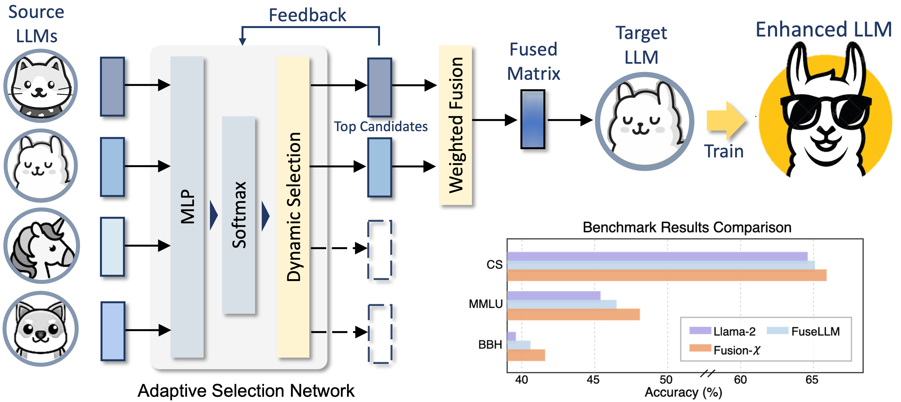

# Enabling Flexible Multi-LLM Integration for Scalable Knowledge Aggregation

[arXiv](https://arxiv.org/pdf/2505.23844) 

Existing methods for merging LLMs are memory-intensive and prone to task interference. We propose a framework that adaptively selects and fuses knowledge from multiple LLMs, enabling more scalable, stable, and memory-efficient integration—reducing interference by up to 50% compared to prior approaches.

<p align="center">
   <br>
</p>


## 💻 Usage

### Environment Settings

```
conda create -n fusionx python=3.9

conda activate fusionx

pip3 install torch==2.1.2 torchvision==0.16.2 torchaudio==2.1.2 --index-url https://download.pytorch.org/whl/cu121

pip install -r requirements.txt
```
### 📚 Data Processing
Please follow the detailed guidelines in https://github.com/fanqiwan/FuseAI/tree/main/FuseLLM

### ⭐ Training

```
sbatch train_deepspeed_local_dynamic.script
```


## 📝 Evaluation

### Commonsense Benchmark

```
git clone https://github.com/EleutherAI/lm-evaluation-harness.git

cd lm-evaluation-harness

pip3 install -e .

pip3 install omegaconf pycountry sentencepiece protobuf
```
#### Run Evaluation
```
bash run-lm-eval.sh
```

### BBH & MMLU Benchmark
```
git clone https://github.com/allenai/open-instruct.git

cd open-instruct

pip install -r requirements.txt
```

#### Run Evaluation
```
./scripts/data/prepare_eval_data.sh

bash scripts/eval/bbh.sh
```

## Citation
If you find our work useful in your research, please consider citing:
```
@misc{kong2025enablingflexiblemultillmintegration,
      title={Enabling Flexible Multi-LLM Integration for Scalable Knowledge Aggregation}, 
      author={Zhenglun Kong and Zheng Zhan and Shiyue Hou and Yifan Gong and Xin Meng and Pengwei Sui and Peiyan Dong and Xuan Shen and Zifeng Wang and Pu Zhao and Hao Tang and Stratis Ioannidis and Yanzhi Wang},
      year={2025},
      eprint={2505.23844},
      archivePrefix={arXiv},
      primaryClass={cs.CL},
      url={https://arxiv.org/abs/2505.23844}, 
}
```
